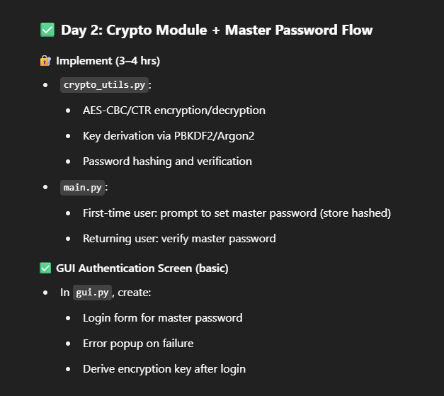

progress at the end of DAY-2:
coded on `crypto_utils.py`, `main.py`, `gui.py`
Setup the encoding and decoding functions for safety of the data which will be stored by the user in the future usign AES(Advanced Encryption Standard) encryption in CBC(cypher Block chaining) mode
Also setup the hashing function for the master key which will we used to hash the master password and will be verified everytime the user enters the passwords when logging in into the Password Manager
Setup basic GUI(Graphical User Interface) with login and reset the password features.
Everything functional

Steps to run the project:
Download the repo
from the home directory, run the below command:
1) `python .\main.py` --> This will direct you to set your master password in the CLi(Command Line Interface)
2) `python .\gui.py` --> This will open a non-resizable GUI window where you will login with your master password or reset it if you want to

